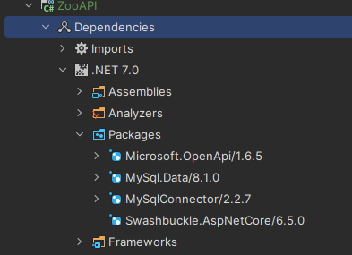
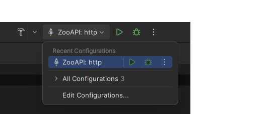

# Projektaufgabe Zoo RESTful API

**Eine erfolgreiche Absolvierung dieser Aufgabe ist Voraussetzung für ein Abschlussprojekt.**

Ziel dieses Projekts ist eine komplette Anwendung mit Frontend, Backend, inklusive Datenbankanbindung.

Drei unterschiedliche Funktionen müssen implementiert werden:

- Informationen für Besucher
- Ticketkauf aus Sicht des Kassierers und Gesamtansicht der Ticketverkäufe
- Informationen für Tierpfleger

Wie bereits im Unterricht wird eine [minimal API](https://learn.microsoft.com/en-us/aspnet/core/fundamentals/minimal-apis?view=aspnetcore-7.0) entwickelt.

## Datenbank

Erstelle für diese Anwendung einen Benutzer, der nur die notwendigen Rechte hat, die notwendig sind für den
Betrieb der API.

- Tiere müssen lesbar sein und Updates müssen ermöglicht werden.
- Für den Ticketkauf werden Schreib- und Leserechte benötigt.
  - Leserechte braucht für die Auskunft der verkauften Tickets.

### Benutzer erstellen

Verwende die im Unterricht erstellte Zoodatenbank.

- Stelle eine SSH Verbindung her und füge einen Screenshot des unten angebenden ausgeführten Befehls ein.
- Verwende für die Screenshots den `img` Ordner.

~~~sql
SHOW GRANTS FOR 'username'@'localhost';
~~~

Nicht vergessen, den Username entsprechend anzupassen.

- Füge Daten in deine Datenbank ein, damit du später Abfragen testen kannst.
- Stelle eine Verbindung mit Rider zu deiner DB her, um Abfragen entsprechend testen zu können. Alternativ: verwende
  einen beliebigen anderen Client.

## Backend

Als Erstes stelle eine Datenbankverbindung her. Verwende dafür die Klasse `DBConnection`. Wiederverwende diese Verbindung.

Die URLs der nachfolgenden Endpoints kannst du selbst wählen. Für den Zoobesucher, den Kassierer und den Tierpfleger gibt es eigene Controller Klassen.

### Zoobesucher

- Alle Tiere sollen als Datenstruktur zur Verfügung gestellt werden.
- Mit dem Namen als Parameter soll nach einem Tier gesucht werden können. Je nach Implementierung wird ein
  einzelnes Tier als JSON, oder mehrere als Datenstruktur zurückgegeben.

### Kassierer

- Ein Kassier bedient ein Kassensystem und verkauft Tickets. Ein verkauftes Ticket wird in die Datenbank mit einem
  [Zeitstempel](https://mariadb.com/kb/en/timestamp/) gespeichert. Du wirst hier deine Tabelle anpassen müssen.
- Ein Ticket wird als Objekt im model Ordner modelliert. Felder müssen zumindest der Ticketpreis und das
  [Verkaufsdatum](https://dev.mysql.com/doc/dev/connector-net/6.10/html/T_MySql_Data_Types_MySqlDateTime.htm) sein.
- Eine weitere Schnittstelle informiert über die Gesamtverkäufe aller Tickets.
- Alle Tickets, die an einem bestimmten Tag verkauft wurden, inklusive Summe werden zur Verfügung gestellt.

### Tierpfleger

- Der Pfleger soll alle Tiere sehen, die er selbst zugeordnet ist.
- Weiters kann er Elemente von Tieren updaten, über die ID.
- Tiere werden wieder im model Ordner entsprechend als Objekt dargestellt.
- Es können beliebig viele sinnvolle Klassen hinzugefügt werden.

Wie oben beschrieben sollen die Endpoints selbst zu wählen, sie müssen aber mit Swagger dokumentiert sein.

### Error Handling

Es muss Errorhandling geben. Bei Fehler setzte den entsprechenden [HTTP Statuscode](https://developer.mozilla.org/en-US/docs/Web/HTTP/Status). Das funktioniert sehr einfach, wenn du wie im Beispiel ein Result zurückgibst.

## Frontend

Setzte ein Frontend mit React um. Es muss eine Startseite zum Auswählen der Services geben. Für den Zoobesucher,
den Kassierer und den Tierpfleger gibt es eine eigene View geben. Folgender Stack wird vorgeschlagen:

- vite
- react
- react-router
- MaterialUI

Wobei nur react verpflichtend einzusetzen ist. Das Frontend darf gerne gut aussehen :smiley:

**Setzte die Webiste im frontend Ordner um**. Das ist wichtig, um das Projekt abgeben zu können.

## Zusätzliche Informationen

Alle Dependencies, die benötigt werden, sind bereits eingebunden.

Der Json Serializier wurde durch die Implementierung von ASP.NET Core ersetzt. Darum muss auch nicht mehr der Content
Type gesetzt. Die MySql Datentypen sind auch schon enthalten.

> Achte auf sauberen Code und **Do not repeat yourself**.

- Es sind natürlich bei der Abgabe mehrere Review-Zyklen erlaubt. Du kannst auch öfter commiten und pushen, solange du
  keinen Pull Request stellst, wird es nicht reviewd. Achte aber auf saubere Pull Request und ordentliche Commit Messages.
- Fragen können jederzeit auf Teams gestellt werden. Bei Bedarf biete ich eine online Q/A Session an.
- Verwende statische Codeanalyse.
- Erledige die Aufgabe in Teilen und nicht am letzten Tag alles auf einmal.
- Vergiss nicht auf das aktualisierte Beispielprojekt.

## Ausführen

Nicht vergessen, HTTP auszuwählen.

